# Space Invaders — Development History

## Iterative Development Timeline

---

---

## Design Principles Established

| Principle | Description |
|-----------|-------------|
| **Level-driven difficulty** | Speed and bullet rate scale by level progression, not by kills |
| **Fair progression** | Player controls pace — survive to level up, then face harder challenge |
| **Clean transitions** | Game pauses during level change; all entities cleared before respawn |
| **Predictable mechanics** | Same level always plays the same way regardless of kill order |
